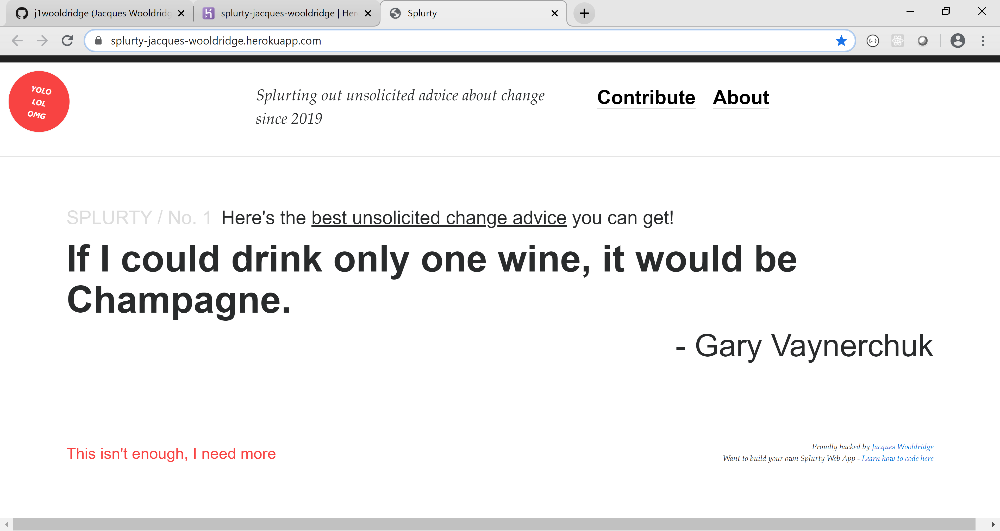

# README

A database-powered quote generator with a mobile-first design, using the Ruby on Rails framework, HTML, and CSS. Uses Git and GitHub for version control, and launched on Heroku.

Deployed Version

Visit https://splurty-jacques-wooldridge.herokuapp.com/ to deploy the app.

Screenshot Version

 

Jacques Wooldridge.